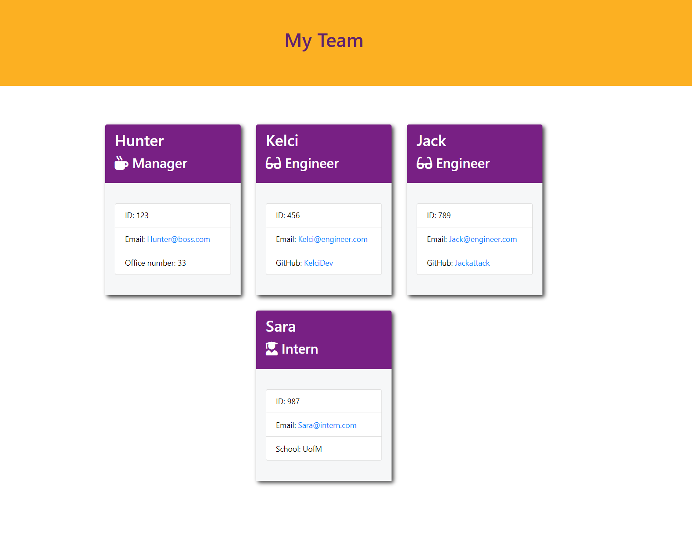

# Team-Profile-Generator
## Badge 

## Description 
This application was created to be used to make a team profile html that displays the different members of the team, they're role and contact information. Based on the user input from inquirer in the node terminal which writes an html file using the user input. the html will automatically connect with the css file and style your html for you. A screenshot of the deployed html example can be found below in the images section. 

## Table of Contents (Optional)
- [Installation](#installation)
- [Usage](#usage)
- [Images](#images)
- [Credits](#credits)
- [License](#license)
- [Features](#features)
- [Contribute](#how-to-contribute)
- [Testing](#tests)
- [E-mail](#e-mail)
## Installation
Clone this repository from github. Make sure to install Node.js if you haven't already. Then in the terminal run NPM i to install all the packages. Run node index.js and answer the prompts after an html file will be generated displaying your team. 
## Usage
Use the command line to type node index.js then inquirer will run the prompts for you. You just have to answer the questions with the appropriate Information and the team-profile will be generated also run jest for testing of constructors. You can view a walk through video here - [Screencastify](https://watch.screencastify.com/v/2j67EGGlSCGIXtiWBhe0)

## Images

## Credits
Made by hunter with skill!
## License
MIT License
Permission is hereby granted, free of charge, to any person obtaining a copy of this software and associated documentation files the Software, to deal in the Software without restriction, including without limitation the rights to use, copy, modify, merge, publish, distribute, sublicense, and/or sell copies of the Software, and to permit persons to whom the Software is furnished to do so, subject to the following conditions. Click on Badge for more info.
## Features

## How to Contribute
contributors should just read the installion section. 
## Tests
Run 'npm test' to run jest and test the constructors. 
## Questions
### Username
<a href="https://github.com/Skruphold">Skruphold</a>
### E-mail
<a href="mailto: Hunterco999@gmail.com">Hunterco999@gmail.com</a>